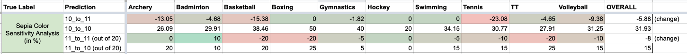

# Twitter Algorithmic Bias

Submission for Twitter Algorithmic Bias Hackathon

## Saliency Model Focus

The images for the olympics athletes were scraped from [GettyImages](https://www.gettyimages.in/). A total of 5000 images were downloaded, 500 each for 10 different games :
- Archery
- Badminton
- Basketball
- Boxing
- Gymnastics
- Hockey
- Swimming
- Tennis
- TT (Table Tennis)
- Volleyball

These images were then passed through a simple [Object Detection model](https://tfhub.dev/google/openimages_v4/ssd/mobilenet_v2/1) to identify whether people were present in the image or not. This was used to divide them into "Images with athlete" and "Non-Athlete Images" which was used further in analysis.

The saliency model was applied to these images and the crops obtained were visually inspected. It was argued that the model should focus on the athletes present in the image and not on other objects such as billboards, crowd or random locations within the arena. 

Hence, a terminology was developed around this. If the image contained an athlete, the "True Label" of the image was considered to be 1. Now, if the crop of this image focused on the athlete, it would count as a positive (1) output and if it focused on anything other than the athletes, it would count as a negative (0) output. These terminologies combined gave rise to **10** images which are potentially problematic (input is 1 while the output is 0) and **11** images which are perfectly fine (input is 1 and the output is 1 too).

These type of images were visually found out and the numbers are summarised in the following table :

This misrepresentation of the focus majorly included focus on either banners with "Tokyo 2020" or "Olympic Logo", focus on billboards with advertisements or crowd. The examples of these cases are :

## Sensitivity Analysis of the model

We performed 2 kinds of sensitivity analysis on the saliency model. The first kind of sensitivity is on the focal point selection. We inspected whether a 10 image can turn to a 11 image if we crop out the non-athlete object which the model is focusing on and vice-versa. The second kind of sensitivity analysis performed was based on the colouration of the image.

### Sensitivity to Focal Points

Here is a summary of the sensitivity analysis performed for all the 10 sports :

We observe from the table that if the non-athlete object is removed, there is a very high chance (about north of 70%) that the 10 image would get converted to 11 image. However, there are still a significant cases where the saliency model continued to latch on to something other than the athletes.

This can be observed in the reverse case too when the model got confused after removing previously focused athletes.

### Sensitivity to Color

We tried 2 color variations i.e. grayscale and sepia for testing out the saliency model's sensitivity to color scheme of the image. The same experiment as the sensitivity analysis was performed and the relative performance was noted. The results obtained are summarised in the table below :

It can be observed that overall, the saliency model performs worse in grayscale and sepia images as compared to original color images.

More details on these analysis are present in [Excel File](assets/Twitter_Algorithmic_Bias_Olympics.xlsx).

## Additional Analysis

### Brand Analysis
 
We performed a short analysis on different sports brands trying to gauge which brands are being focused more on by the saliency model. A ranking was obtained for some sports brands and is present in [This Image](brands_analysis/brands_ordered.jpg). 

This was carried out by repeatedly passing the image through the saliency model, each time noting down and removing the brand selected.

### Crowd Analysis

We performed another short analysis hoping to find some patterns in the selection of people in a sea of faces by the saliency model. However, this requires a lot of labelled data to draw any inferences / conclusions on the performance of the model in terms of its bias. Due to unavailability of an open high-quality dataset, this was scrapped.

However, some cartoon sea of faces were downloaded and scraped from Google Imaged and analysed. On visual inspection and noting down some parameters of the faces selected, no obvious bias was found.

## Bias Implications of the Results Found

From the results obtained, it can be seen that the saliency model has a good chance of totally ignoring the context of the image (here, it is being the olympics), and focus on either background elements or advertisements. This is a type of "Mis-Representation" bias of the image.

Also, another strong observation that stems out from this study is the heavy preference of the salience model to focus on text, whether that text is remotely close to the image or not. For example, below is a sample output of the saliency model which totally ignores the photograph and its context and just focuses on the "The Guardian". There are several other examples that we have come across in this study which prove the same.

#### Further Information

- [Prasang Gupta](mailto:prasang.gupta@pwc.com), Experienced Associate, PwC US Advisory
- [Amitoj Singh](mailto:amitoj.x.singh@pwc.com), Senior Associate, PwC US Advisory
- [Ilana Golbin](mailto:ilana.a.golbin@pwc.com), Global Responsible AI Leader, PwC US Advisory
- [Anand Rao](mailto:anand.s.rao@pwc.com), Global AI Leader, PwC US Advisory